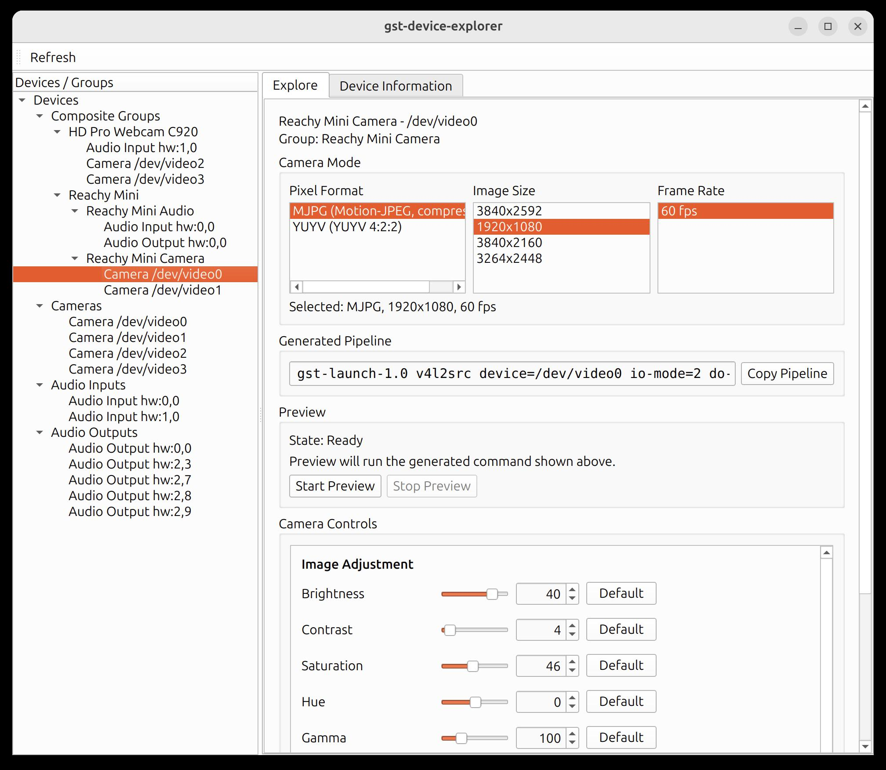

# gst-device-explorer

`gst-device-explorer` is a GUI-first media endpoint explorer for NVIDIA Jetson systems and Ubuntu workstations.

It discovers cameras, microphones, speakers, and composite USB/media devices, then helps you inspect capabilities, generate GStreamer commands, and safely try selected hardware actions.

The project is intended for embedded media work on Jetson developer kits and Ubuntu 24.04+ systems, especially with USB cameras, USB audio devices, and devices such as small robots that expose several media endpoints.

## Requirements

Tested target platforms:

- NVIDIA Jetson systems running Jetson Linux 38+
- Ubuntu 24.04+

The GUI uses PySide6 / Qt. Device discovery and media testing depend on common Ubuntu media tools, including GStreamer, V4L2 tools, and ALSA utilities.

## Why use it

Media devices often appear as separate endpoints: `/dev/video0`, ALSA capture devices, ALSA playback devices, and USB composite devices. Figuring out which endpoint does what usually means jumping between command-line tools.

`gst-device-explorer` brings that discovery workflow into one application.

You can use it to:

- find connected cameras, microphones, and speakers
- inspect camera modes, audio formats, sample rates, and channel counts
- see which endpoints appear to belong to the same physical device
- preview a selected camera mode
- adjust supported camera controls such as brightness or exposure
- test speakers with a generated tone
- play a local audio file through a selected output device
- check whether a microphone endpoint opens without recording audio
- copy generated GStreamer commands for manual testing



## Install

This project uses `uv` for Python environment and dependency management.

Install `uv`:

```sh
curl -LsSf https://astral.sh/uv/install.sh | sh
```

If your system does not have `curl`, use `wget`:

```sh
wget -qO- https://astral.sh/uv/install.sh | sh
```

After installation, restart your shell or follow the installer instructions to update your `PATH`.

Clone the repository and install dependencies:

```sh
git clone https://github.com/jetsonhacks/gst-device-explorer.git
cd gst-device-explorer
uv sync
```

Some probes depend on Ubuntu media tools. On Jetson Linux 38+ and Ubuntu 24.04+ systems, useful packages typically include GStreamer tools, V4L2 tools, and ALSA utilities.

See `docs/SETUP.md` for system packages and verification commands.

## Run

Launch the live GUI:

```sh
uv run gst-device-explorer
```

Launch the demo GUI (synthetic devices, no real hardware probed):

```sh
uv run gst-device-explorer --demo
```

## GUI overview

The Explore view is the primary surface for each selected device:

- **Camera**: mode selection, generated preview pipeline, preview start/stop, supported camera-control writes
- **Audio Output**: generated tone test, local-file playback test, pipeline-local level presets
- **Audio Input**: bounded non-recording activity test
- **Composite Groups**: endpoint cards and navigation for related devices

Group views explain and navigate. They do not run group-level pipelines or synchronized capture.

## Typical workflow

1. Start the GUI.
2. Select a camera, microphone, speaker, or composite group in the sidebar.
3. Use **Explore** to inspect modes and generated commands.
4. Run only explicitly supported actions.

## Camera exploration

The camera view can show discovered modes, generate a preview pipeline, start and stop preview, and expose supported camera controls. Writable controls can be adjusted for the selected camera endpoint, and individual controls can be reset to their reported default when available.

## Audio output testing

The audio output view can run a generated tone test or play a selected local audio file through the selected output endpoint. Test level and playback level are pipeline-local settings; they do not change system volume, mixer settings, or routing.

## Audio input checking

The audio input view can open a selected input endpoint using a bounded non-recording test. It is intended to confirm that the endpoint is available. It does not record, save, or retain microphone audio.

For deeper microphone quality testing, use an external audio application suited to capture and playback review.

## Composite device groups

Composite group views help explain when multiple endpoints appear to belong to the same physical device. Groups are navigation and explanation surfaces; actions still happen on individual endpoints.

## Command-line interface

The project also includes a CLI for setup, debugging, automation, and development.

```sh
uv run gst-device-explorer-cli --help
```

For detailed setup checks and command examples, see `docs/SETUP.md`.

## Safety notes

The GUI runs only supported actions generated for the selected endpoint. It does not accept arbitrary GStreamer pipeline text or shell commands.

The application does not provide group-based execution, synchronized capture, long-running recording workflows, arbitrary V4L2 command entry, or system audio mixer/routing controls.

## Project status

`gst-device-explorer` is under active development. The current focus is a practical GUI for media-device exploration on Jetson Linux 38+ and Ubuntu 24.04+ systems.

Recent work has focused on:

- camera preview and camera-control adjustment
- audio output tone and local-file playback tests
- audio input availability testing without recording
- composite device grouping
- cleaner GUI workflows around generated GStreamer commands

## Repository layout

```text
src/gst_device_explorer/
  cli/       command-line interface
  core/      shared models, pipeline candidates, diagnostics
  gui/       PySide6 GUI
  probes/    V4L2, ALSA, GStreamer, and system probing

docs/        setup, architecture, and product documentation
tests/       unit and GUI tests
```

## Documentation

See [docs/README.md](docs/README.md) for a full index.

Start with:

- `docs/SETUP.md`
- `docs/ARCHITECTURE.md`
- `docs/APP_PRODUCT_SPEC.md`

## Contributing

This project changes quickly. Before adding new user-facing behavior, prefer a small milestone document that states the user problem, proposed behavior, safety boundary, out-of-scope work, and test plan.

Keep generated commands structured, endpoint-specific, and testable. Avoid arbitrary command execution and hidden system changes.